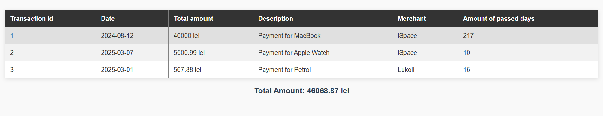

# Лабораторная работа №3. Массивы и Функции

## Цель работы

Освоить работу с массивами в PHP, применяя различные операции: создание, добавление, удаление, сортировка и поиск. Закрепить навыки работы с функциями, включая передачу аргументов, возвращаемые значения и анонимные функции.

## Условие

### Задание 1. Работа с массивами

Разработать систему управления банковскими транзакциями с возможностью:

- добавления новых транзакций;
- удаления транзакций;
- сортировки транзакций по дате или сумме;
- поиска транзакций по описанию.

#### Задание 1.1. Подготовка среды

1. Убедитесь, что у вас установлен PHP 8+.
2. Создайте новый PHP-файл `index.php`.
3. В начале файла включите строгую типизацию:

   ```php
   <?php

   declare(strict_types=1);
   ```

#### Задание 1.2. Создание массива

Создайте массив `$transactions`, содержащий информацию о банковских транзакциях. Каждая транзакция представлена в виде ассоциативного массива с полями:

- `id` – уникальный идентификатор транзакции;
- `date` – дата совершения транзакции (YYYY-MM-DD);
- `amount` – сумма транзакции;
- `description` – описание назначения платежа;
- `merchant` – название организации, получившей платеж.

```php
<?php
declare(strict_types=1);

// Массив транзакций с различными данными
$transactions = [
    // Первая транзакция
    [
        "id" => 1, // Уникальный идентификатор транзакции
        "date" => new DateTime("2024-08-12"), // Дата транзакции (объект DateTime)
        "amount" => 40000.00, // Сумма транзакции
        "description" => "Payment for MacBook", // Описание транзакции
        "merchant" => "iSpace", // Продавец
    ],
    // Вторая транзакция
    [
        "id" => 2, // Уникальный идентификатор транзакции
        "date" => new DateTime("2025-03-07"), // Дата транзакции
        "amount" => 5500.99, // Сумма транзакции
        "description" => "Payment for Apple Watch", // Описание транзакции
        "merchant" => "iSpace", // Продавец
    ],
    // Третья транзакция
    [
        "id" => 3, // Уникальный идентификатор транзакции
        "date" => new DateTime("2025-03-01"), // Дата транзакции
        "amount" => 567.88, // Сумма транзакции
        "description" => "Payment for Petrol", // Описание транзакции
        "merchant" => "Lukoil", // Продавец
    ],
];

```
Было добавлено 3 транзакции, в которых указан идентификатор, дата, сумма, описание и продавец.

#### Задание 1.3. Вывод списка транзакций

1. Используйте `foreach`, чтобы вывести список студентов в HTML-таблице.

```php
<?php

declare(strict_types=1);
require_once 'functions.php';
require_once 'transactions.php';

?>

<!DOCTYPE html>
<html lang="en">
<head>
    <meta charset="UTF-8">
    <meta name="viewport" content="width=device-width, initial-scale=1.0">
    <title>Transaction Report</title>
    <link rel="stylesheet" href="styles.css">
</head>
<body>
    <table border='1'>
        <thead>
            <tr>
                <th>Transaction id</th>
                <th>Date</th>
                <th>Total amount</th>
                <th>Description</th>
                <th>Merchant</th>
                <th>Amount of passed days</th>
            </tr>
        </thead>
        <tbody>
            <?php foreach ($transactions as $transaction): ?>
                <tr>
                    <td><?php echo $transaction["id"]; ?></td>
                    <td><?php echo $transaction["date"]->format('Y-m-d'); ?></td>
                    <td><?php echo $transaction["amount"]; ?> lei</td>
                    <td><?php echo $transaction["description"]; ?></td>
                    <td><?php echo $transaction["merchant"]; ?></td>
                    <td><?php echo daysSinceTransaction($transaction["date"]); ?></td>
                </tr>
            <?php endforeach; ?>
        </tbody>
    </table>
    <p>Total Amount: <?php echo calculateTotalAmount($transactions); ?> lei</p>
</body>
</html>
```
В main.php был добавлен вывод данных в таблице, которая берет все необходимое из transactions.php, с использованием нескольких функций из файла functions.php

Результат:


#### Задание 1.4. Реализация функций

Создайте и используйте следующие функции:

1. Создайте функцию `calculateTotalAmount(array $transactions): float`, которая вычисляет общую сумму всех транзакций.
   - Выведите сумму всех транзакций в конце таблицы.
2. Создайте функцию `findTransactionByDescription(string $descriptionPart)`, которая ищет транзакцию по части описания.
3. Создайте функцию `findTransactionById(int $id)`, которая ищет транзакцию по идентификатору.
   - Реализуйте данную функцию с помощью обычного цикла `foreach`.
   - Реализуйте данную функцию с помощью функции `array_filter` (на высшую оценку).
4. Создайте функцию `daysSinceTransaction(string $date): int`, которая возвращает количество дней между датой транзакции и текущим днем.
   - Добавьте в таблицу столбец с количеством дней с момента транзакции.
5. Создайте функцию `addTransaction(int $id, string $date, float $amount, string $description, string $merchant): void` для добавления новой транзакции.
   - Примите во внимание, что массив `$transactions` должен быть доступен внутри функции как глобальная переменная.

```php
<?php

declare(strict_types=1);

/**
 * Вычисляет общую сумму транзакций.
 * 
 * Эта функция суммирует все значения транзакций и возвращает общую сумму.
 * 
 * @param array $transactions Массив транзакций.
 * @return float Возвращает общую сумму транзакций.
 */
function calculateTotalAmount(array $transactions): float {
    $total = 0;
    foreach ($transactions as $transaction) {
        $total += $transaction["amount"];
    }
    return $total;
}

/**
 * Ищет транзакции, содержащие заданную подстроку в описании.
 * 
 * Эта функция ищет транзакции, у которых описание содержит указанную подстроку (без учета регистра).
 * 
 * @param array $transactions Массив транзакций.
 * @param string $descriptionPart Подстрока для поиска в описании транзакции.
 * @return array Массив транзакций, описание которых содержит подстроку.
 */
function findTransactionByDescription(array $transactions, string $descriptionPart): array {
    $foundTransactions = [];

    foreach ($transactions as $transaction) {
        if (stripos($transaction["description"], $descriptionPart) !== false) {
            $foundTransactions[] = $transaction;
        }
    }

    return $foundTransactions;
}

/**
 * Ищет транзакцию по её идентификатору.
 * 
 * Эта функция ищет транзакцию по уникальному идентификатору.
 * 
 * @param array $transactions Массив транзакций.
 * @param int $id Идентификатор транзакции.
 * @return array|null Возвращает транзакцию в виде массива, если найдена, иначе возвращает null.
 */
function findTransactionById(array $transactions, int $id): ?array {
    foreach ($transactions as $transaction) {
        if ($transaction["id"] === $id) {
            return $transaction;
        }
    }
    return null;
}

/**
 * Вычисляет количество дней, прошедших с момента указанной даты транзакции.
 * 
 * Эта функция вычисляет разницу в днях между текущей датой и датой транзакции.
 * 
 * @param DateTime $date Дата транзакции.
 * @return int Количество дней, прошедших с момента транзакции.
 */
function daysSinceTransaction(DateTime $date): int {
    $currentDate = new DateTime();
    return $date->diff($currentDate)->days;
}

/**
 * Добавляет новую транзакцию в глобальный массив транзакций.
 * 
 * Эта функция добавляет новую транзакцию в массив `$transactions`, обновляя его.
 * 
 * @param int $id Идентификатор транзакции.
 * @param string $date Дата транзакции.
 * @param float $amount Сумма транзакции.
 * @param string $description Описание транзакции.
 * @param string $merchant Продавец или компания, с которой была совершена транзакция.
 * @return void Функция не возвращает значения.
 */
function addTransaction(int $id, string $date, float $amount, string $description, string $merchant): void {
    global $transactions;

    $transactions[] = [
        "id" => $id,
        "date" => new DateTime($date),
        "amount" => $amount,
        "description" => $description,
        "merchant" => $merchant,
    ];
}

/**
 * Сортирует массив транзакций по дате в порядке возрастания.
 * 
 * Эта функция сортирует массив транзакций по дате в порядке возрастания.
 * 
 * @param array &$transactions Массив транзакций, который будет отсортирован.
 * @return void Функция не возвращает значения, изменяет массив по ссылке.
 */
function sortTransactionsByDate(array &$transactions) {
    usort($transactions, function ($a, $b) {
        return $a["date"] <=> $b["date"];
    });
}

/**
 * Сортирует массив транзакций по сумме в порядке убывания.
 * 
 * Эта функция сортирует массив транзакций по сумме в порядке убывания.
 * 
 * @param array &$transactions Массив транзакций, который будет отсортирован.
 * @return void Функция не возвращает значения, изменяет массив по ссылке.
 */
function sortTransactionsByAmount(array &$transactions): void {
    usort($transactions, function ($a, $b) {
        return $b["amount"] <=> $a["amount"];
    });
}
```

#### Задание 1.5. Сортировка транзакций

1. Отсортируйте транзакции по дате с использованием `usort()`.
2. Отсортируйте транзакции по сумме (по убыванию).

```php
/**
 * Сортирует массив транзакций по дате в порядке возрастания.
 * 
 * Эта функция сортирует массив транзакций по дате в порядке возрастания.
 * 
 * @param array &$transactions Массив транзакций, который будет отсортирован.
 * @return void Функция не возвращает значения, изменяет массив по ссылке.
 */
function sortTransactionsByDate(array &$transactions) {
    usort($transactions, function ($a, $b) {
        return $a["date"] <=> $b["date"];
    });
}

/**
 * Сортирует массив транзакций по сумме в порядке убывания.
 * 
 * Эта функция сортирует массив транзакций по сумме в порядке убывания.
 * 
 * @param array &$transactions Массив транзакций, который будет отсортирован.
 * @return void Функция не возвращает значения, изменяет массив по ссылке.
 */
function sortTransactionsByAmount(array &$transactions): void {
    usort($transactions, function ($a, $b) {
        return $b["amount"] <=> $a["amount"];
    });
}
```

### Задание 2. Работа с файловой системой

1. Создайте директорию `"image"`, в которой сохраните не менее 20-30 изображений с расширением .jpg.
2. Затем создайте файл `index.php`, в котором определите веб-страницу с хедером, меню, контентом и футером.
3. Выведите изображения из директории `"image"` на веб-страницу в виде галереи.

```php
   <?php  
// Указываем папку с изображениями
$dir = 'images/';

// Получаем список всех файлов в папке
$files = scandir($dir);

// Проверка на ошибки при открытии папки
if ($files === false) {
    echo "Ошибка: не удалось открыть папку с изображениями!";
    $files = [];  // Инициализируем пустой массив в случае ошибки
}
?>

<!DOCTYPE html>
<html lang="en">
<head>
    <meta charset="UTF-8">
    <meta name="viewport" content="width=Б, initial-scale=1.0">
    <title>Porsche</title>
    <link rel="stylesheet" href="styles.css">
</head>
<body>
    <header>
        <h1>Porsche Gallery</h1>
        <p>Company | Products | Motorsports</p>
    </header>
    <main>
        <div class="gallery">
            <?php
            // Проходим по каждому файлу в директории
            for ($i = 0; $i < count($files); $i++) {
                // Пропускаем текущую и родительскую директории, а также проверяем, что файл - изображение
                if ($files[$i] !== "." && $files[$i] !== ".." && preg_match('/\.(jpg|jpeg|png|gif)$/i', $files[$i])) {
                    // Формируем полный путь к файлу
                    $path = $dir . $files[$i];
            ?>
            <div class="image">
                <!-- Выводим изображение на страницу -->
                " alt="Image">
            </div>
                    <?php
                }
            }
            ?>
        </div>
    </main>
    <footer>
        <!-- Выводим текущий год -->
        <p>© <?php echo date("Y"); ?></p>
    </footer>
</body>
</html>
```
Результат:


## Документация кода

Код должен быть корректно задокументирован, используя стандарт `PHPDoc`. Каждая функция и метод должны быть описаны с указанием их входных параметров, выходных данных и описанием функционала. Комментарии должны быть понятными, четкими и информативными, чтобы обеспечить понимание работы кода другим разработчикам.

## Контрольные вопросы

1. Что такое массивы в PHP?
Массивы в PHP — это структуры данных, которые позволяют хранить несколько значений в одной переменной. Массивы могут быть индексированными или ассоциативными.
2. Каким образом можно создать массив в PHP?
Для создания индексированного массива можно использовать функцию array() или короткую синтаксическую запись []
```php
$arr = array(1, 2, 3);  // старый способ
$arr = [1, 2, 3];       // новый способ
```
Для создания ассоциативного массива используется аналогичный подход, но с указанием ключей:
```php
$arr = array("key1" => "value1", "key2" => "value2"); // старый способ
$arr = ["key1" => "value1", "key2" => "value2"];      // новый способ
```
3. Для чего используется цикл `foreach`?
Цикл foreach используется для перебора элементов массива или объекта. Он удобен, когда нужно пройти по всем элементам без необходимости явно указывать индексы.
