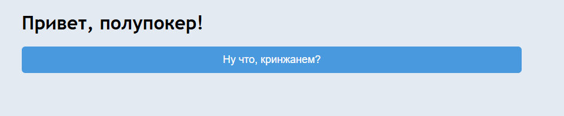
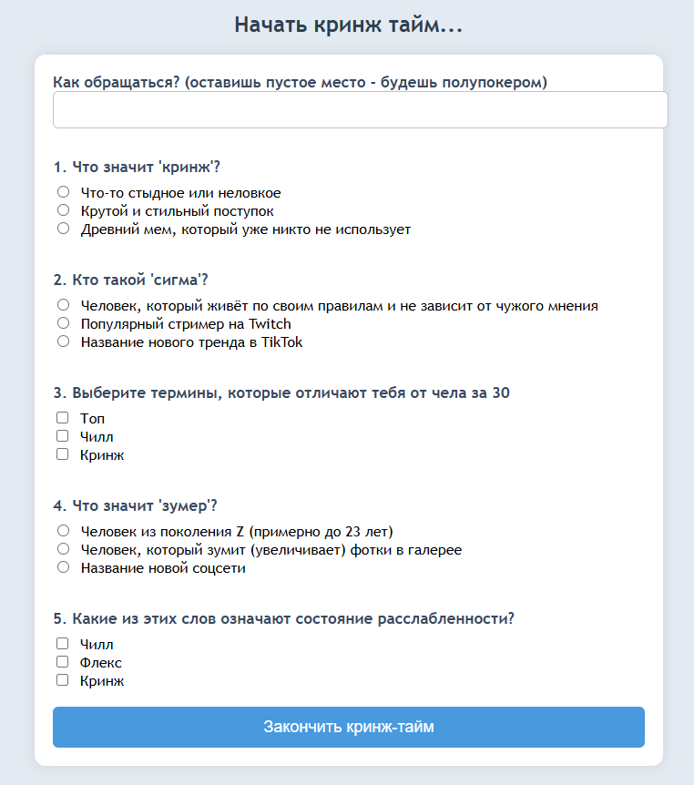
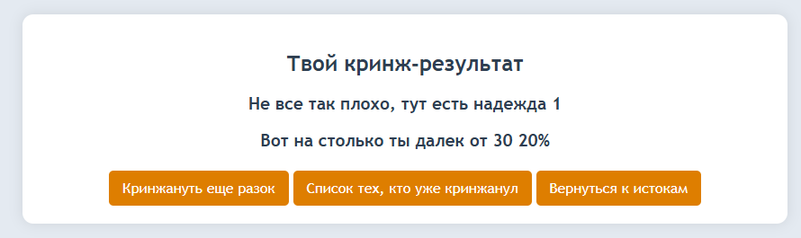
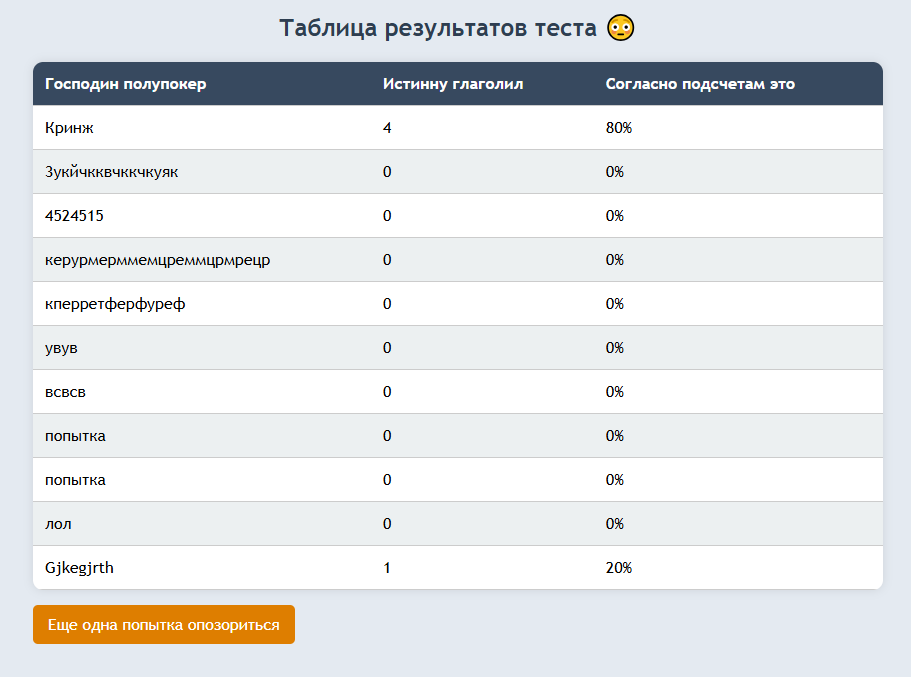

```markdown
Альтернативная аттестационная работа 01. Разработка веб-приложения для создания и прохождения тестов

# Проект: Тест по кринжу

Данный проект это мини веб-приложение или иначе говоря форма, для прохождения теста. Тест состоит из вопросов с возможностью выбора одно ответа или несколько. После завершения теста пользователь может увидеть свой результат, вернуться на главную или пройти тест еще раз, который сохраняется в формате JSON и отображается в таблице на странице результатов.

# Условия cдачи работы
Защита работы обязательна до 14.03.2025
При оценке выше 9 и выше написание аттестационной работы не допускается.
Иначе допускается написание аттестационной работы, но её оценка станет итоговой.


## Структура проекта

1. **index.php** - Главная страница
2. **test.php** - Страница теста
3. **result.php** - Страница результатов
4. **dashboard.php** - Страница с таблицей результатов
5. **process_test.php** - Логика
6. **data.json** - Файл, где вопросы теста и результаты
7. **style.css** - стилизация


#### **Инструкции по запуску проекта:**
1. Скачайте проект и разместите его в корневой директории вашего веб-сервера.
2. Убедитесь, что PHP установлен и настроен на вашем сервере.
3. Убедитесь, что файл `data.json` существует в корневом каталоге, где хранятся вопросы и результаты тестов.
4. Откройте проект в вашем веб-браузере, перейдите по адресу `test.php` для начала теста.


#### **Примеры тестов:**
Приложение использует несколько вопросов о сленге, включая вопросы с одиночным выбором (radio buttons) и множественным выбором (checkbox). 

#### **Структура базы данных или файла:**
Файл `data.json` хранит вопросы теста и результаты пользователей в формате JSON. Структура данных выглядит следующим образом:

```json
{
  "questions": [
    {
      "question": "Что значит 'кринж'?",
      "type": "radio",
      "answers": ["Что-то стыдное или неловкое", "Крутой и стильный поступок", "Древний мем, который уже никто не использует"],
      "correct": ["1"]
    },
    
  ],
  "results": [
    {
      "username": "Полупокер",
      "correct": 1,
      "score": 20
    },
    
  ]
}
```

#### **Скриншоты работы приложения:**
1. **Главная страница:** Кнопка для перехода к тесту.

2. **Страница теста:** Форма с вопросами и вариантами ответов.

3. **Результаты теста:** Страница, где показывается количество правильных ответов и процент.

4. **Таблица результатов:** Страница, отображающая список всех пользователей и их результаты.


---

## Описание файлов

### `index.php`

Главная страница формы.

- **Задача**: Приветствует молодого и не очень пользователя и предоставляет кнопку для начала.
- **Ключевые моменты**:
  - Используется простая HTML-страница с кнопкой, которая ведет к `test.php`.

```html
<?php
/**
 * Главная страница, на которой приветствуется пользователь и предоставляется кнопка для начала прохождения теста.
 * 
 * Страница содержит кнопку для перехода на страницу с тестом, а также стилизацию с использованием внешнего CSS.
 */
?>

<!DOCTYPE html>
<html lang="ru">
<head>
    <meta charset="UTF-8">
    <meta name="viewport" content="width=device-width, initial-scale=1.0">
    <title>Основа кринжа</title>
    <link rel="stylesheet" href="css/style.css"> 
</head>
<body>

<div class="container">
    <h1 class="title">Привет, полупокер!</h1>
    
    <a href="test.php">
        <button class="start-button">Ну что, кринжанем?</button>
    </a>
</div>

</body>
</html>

```

---

### `test.php`

Страница, где пользователь проходит тест.

- **Задача**: Показывает форму с вопросами, на которые пользователь нужно ответить.
- **Ключевые моменты**:
  - Для каждого вопроса создается поле для ответа (радио-кнопки или чекбоксы).
  - Вопросы загружаются из файла `data.json`.
  - Ответы отправляются через форму методом POST.

```php
<?php
require_once 'process_test.php';
?>

<!DOCTYPE html>
<html lang="ru">
<head>
    <meta charset="UTF-8">
    <meta name="viewport" content="width=device-width, initial-scale=1.0">
    <title>Вечный слава тебе, полупокер ты наш</title>
    <link rel="stylesheet" href="css/style.css">
</head>
<body>

<h2>Начать кринж тайм...</h2>

<form action="test.php" method="POST">
    <label>Как обращаться? (оставишь пустое место - будешь полупокером)</label>
    <input type="text" name="username" required>

    <?php 
    foreach ($questions as $index => $q): 
        if (empty($q["question"]) || empty($q["answers"])) continue;
    ?>
        <p><?php echo ($index + 1) . ". " .htmlspecialchars($q["question"]); ?></p>
        
        <?php 
        foreach ($q["answers"] as $key => $answer): 
            $inputType = htmlspecialchars($q["type"]); 
            $inputName = "answer[$index]";

            if ($inputType == 'checkbox') {
                $inputName .= '[]';
            }
        ?>
            <input type="<?= $inputType ?>" name="<?= $inputName ?>" value="<?= $key ?>"> 
            <?=htmlspecialchars($answer) ?><br>
        <?php endforeach; ?>
        <br>
    <?php endforeach; ?>

    <button type="submit">Закончить кринж-тайм</button>
</form>

</body>
</html>

```

---

### `result.php`

Страница для отображения результатов после прохождения теста.

- **Задача**: Показывает количество правильных ответов и процент правильных ответов.
- **Ключевые моменты**:
  - Получает данные о результатах через параметры GET (`correct` и `score`).
  - Результаты отображаются в HTML, также предоставлены ссылки для возврата на главную страницу или просмотра таблицы с результатами.

```php
<?php
/**
 * Получение данных из параметров GET запроса.
 * 
 * @var int $correctCount Количество правильных ответов.
 * @var float $score Процент правильных ответов.
 */
$correctCount = isset($_GET["correct"]) ? (int)$_GET["correct"] : 0;
$score = isset($_GET["score"]) ? (float)$_GET["score"] : 0;
?>

<!DOCTYPE html>
<html lang="ru">
<head>
    <meta charset="UTF-8">
    <meta name="viewport" content="width=device-width, initial-scale=1.0">
    <title>Результаты теста</title>
    <link rel="stylesheet" href="css/style.css">
</head>
<body>

<div class="result-box">
    <h2>Ваш результат в тесте</h2>
    <p class="result-text">
        Количество правильных ответов: <b><?= $correctCount ?></b>
    </p>
    <p class="result-text">
        Процент набранных баллов: <b><?= $score ?>%</b>
    </p>
    <a href="test.php" class="button">Пройти тест заново</a>
    <a href="dashboard.php" class="button">Посмотреть таблицу результатов</a>
    <a href="index.php" class="button">Вернуться на главную</a>
</div>

</body>
</html>

```

---

### `process_test.php`

Обрабатывает данные и сохраняет результаты.

- **Задача**: Загружает вопросы из файла `data.json`, проверяет ответы, сохраняет результат и перенаправляет на страницу `result.php`.
- **Ключевые моменты**:
  - Вопросы загружаются из файла `data.json`.
  - Проверяются ответы пользователя и подсчитываются правильные.
  - Результаты сохраняются в файл и передаются на страницу с результатами.

```php
<?php

$dataFile = "data.json";

if (!file_exists($dataFile)) {
    echo "Файл данных не найден.";
    exit;
}

$data = json_decode(file_get_contents($dataFile), true);
$questions = $data["questions"] ?? [];

if (empty($questions)) {
    echo "Нет вопросов для теста.";
    exit;
}

if ($_SERVER["REQUEST_METHOD"] === "POST") {
    $username = $_POST["username"];

    $userAnswers = $_POST["answer"] ?? [];

    $correctCount = 0;
    $totalQuestions = count($questions);

    foreach ($questions as $index => $q) {
        $correct = $q["correct"]; 
        $userResponse = $userAnswers[$index] ?? [];

        if ($q["type"] === "checkbox") {
            sort($userResponse);
            sort($correct);
            if ($userResponse === $correct) {
                $correctCount++;
            }
        } else {
            if ($correct[0] == $userResponse) {
                $correctCount++;
            }
        }
    }

    $score = round(($correctCount / $totalQuestions) * 100, 2);

    $data["results"][] = [
        "username" => $username,
        "correct" => $correctCount,
        "score" => $score
    ];

    file_put_contents($dataFile, json_encode($data, JSON_PRETTY_PRINT));

    header("Location: result.php?correct=$correctCount&score=$score");
    exit;
}

```

---

### `data.json`

Файл, содержащий вопросы и ответы.

- **Задача**: Содержит массив вопросов, типов ответов и правильных ответов.
- **Ключевые моменты**:
  - Каждый вопрос содержит текст, возможные ответы и правильные ответы.
  - Вопросы могут иметь разные типы ответов: `radio` (одиночный выбор) и `checkbox` (множественный выбор).

```json
{
    "questions": [
        {
            "question": "\u0427\u0442\u043e \u0437\u043d\u0430\u0447\u0438\u0442 '\u043a\u0440\u0438\u043d\u0436'?",
            "type": "radio",
            "answers": [
                "\u0427\u0442\u043e-\u0442\u043e \u0441\u0442\u044b\u0434\u043d\u043e\u0435 \u0438\u043b\u0438 \u043d\u0435\u043b\u043e\u0432\u043a\u043e\u0435",
                "\u041a\u0440\u0443\u0442\u043e\u0439 \u0438 \u0441\u0442\u0438\u043b\u044c\u043d\u044b\u0439 \u043f\u043e\u0441\u0442\u0443\u043f\u043e\u043a",
                "\u0414\u0440\u0435\u0432\u043d\u0438\u0439 \u043c\u0435\u043c, \u043a\u043e\u0442\u043e\u0440\u044b\u0439 \u0443\u0436\u0435 \u043d\u0438\u043a\u0442\u043e \u043d\u0435 \u0438\u0441\u043f\u043e\u043b\u044c\u0437\u0443\u0435\u0442"
            ],
            "correct": [
                "0"
            ]
        },
        {
            "question": "\u041a\u0442\u043e \u0442\u0430\u043a\u043e\u0439 '\u0441\u0438\u0433\u043c\u0430'?",
            "type": "radio",
            "answers": [
                "\u0427\u0435\u043b\u043e\u0432\u0435\u043a, \u043a\u043e\u0442\u043e\u0440\u044b\u0439 \u0436\u0438\u0432\u0451\u0442 \u043f\u043e \u0441\u0432\u043e\u0438\u043c \u043f\u0440\u0430\u0432\u0438\u043b\u0430\u043c \u0438 \u043d\u0435 \u0437\u0430\u0432\u0438\u0441\u0438\u0442 \u043e\u0442 \u0447\u0443\u0436\u043e\u0433\u043e \u043c\u043d\u0435\u043d\u0438\u044f",
                "\u041f\u043e\u043f\u0443\u043b\u044f\u0440\u043d\u044b\u0439 \u0441\u0442\u0440\u0438\u043c\u0435\u0440 \u043d\u0430 Twitch",
                "\u041d\u0430\u0437\u0432\u0430\u043d\u0438\u0435 \u043d\u043e\u0432\u043e\u0433\u043e \u0442\u0440\u0435\u043d\u0434\u0430 \u0432 TikTok"
            ],
            "correct": [
                "0"
            ]
        },
        {
            "question": "\u0412\u044b\u0431\u0435\u0440\u0438\u0442\u0435 \u0442\u0435\u0440\u043c\u0438\u043d\u044b, \u043a\u043e\u0442\u043e\u0440\u044b\u0435 \u043e\u0442\u043b\u0438\u0447\u0430\u044e\u0442 \u0442\u0435\u0431\u044f \u043e\u0442 \u0447\u0435\u043b\u0430 \u0437\u0430 30",
            "type": "checkbox",
            "answers": [
                "\u0422\u043e\u043f",
                "\u0427\u0438\u043b\u043b",
                "\u041a\u0440\u0438\u043d\u0436"
            ],
            "correct": [
                "0",
                "1"
            ]
        },
        {
            "question": "\u0427\u0442\u043e \u0437\u043d\u0430\u0447\u0438\u0442 '\u0437\u0443\u043c\u0435\u0440'?",
            "type": "radio",
            "answers": [
                "\u0427\u0435\u043b\u043e\u0432\u0435\u043a \u0438\u0437 \u043f\u043e\u043a\u043e\u043b\u0435\u043d\u0438\u044f Z (\u043f\u0440\u0438\u043c\u0435\u0440\u043d\u043e \u0434\u043e 23 \u043b\u0435\u0442)",
                "\u0427\u0435\u043b\u043e\u0432\u0435\u043a, \u043a\u043e\u0442\u043e\u0440\u044b\u0439 \u0437\u0443\u043c\u0438\u0442 (\u0443\u0432\u0435\u043b\u0438\u0447\u0438\u0432\u0430\u0435\u0442) \u0444\u043e\u0442\u043a\u0438 \u0432 \u0433\u0430\u043b\u0435\u0440\u0435\u0435",
                "\u041d\u0430\u0437\u0432\u0430\u043d\u0438\u0435 \u043d\u043e\u0432\u043e\u0439 \u0441\u043e\u0446\u0441\u0435\u0442\u0438"
            ],
            "correct": [
                "0"
            ]
        },
        {
            "question": "\u041a\u0430\u043a\u0438\u0435 \u0438\u0437 \u044d\u0442\u0438\u0445 \u0441\u043b\u043e\u0432 \u043e\u0437\u043d\u0430\u0447\u0430\u044e\u0442 \u0441\u043e\u0441\u0442\u043e\u044f\u043d\u0438\u0435 \u0440\u0430\u0441\u0441\u043b\u0430\u0431\u043b\u0435\u043d\u043d\u043e\u0441\u0442\u0438?",
            "type": "checkbox",
            "answers": [
                "\u0427\u0438\u043b\u043b",
                "\u0424\u043b\u0435\u043a\u0441",
                "\u041a\u0440\u0438\u043d\u0436"
            ],
            "correct": [
                "0",
                "1"
            ]
        }
    ],
    "results": [
        {
            "username": "\u041a\u0440\u0438\u043d\u0436",
            "correct": 4,
            "score": 80
        },
        {
            "username": "3\u0443\u043a\u0439\u0447\u043a\u043a\u0432\u0447\u043a\u043a\u0447\u043a\u0443\u044f\u043a",
            "correct": 0,
            "score": 0
        },
        {
            "username": "4524515",
            "correct": 0,
            "score": 0
        },
        {
            "username": "\u043a\u0435\u0440\u0443\u0440\u043c\u0435\u0440\u043c\u043c\u0435\u043c\u0446\u0440\u0435\u043c\u043c\u0446\u0440\u043c\u0440\u0435\u0446\u0440",
            "correct": 0,
            "score": 0
        },
        {
            "username": "\u043a\u043f\u0435\u0440\u0440\u0435\u0442\u0444\u0435\u0440\u0444\u0443\u0440\u0435\u0444",
            "correct": 0,
            "score": 0
        },
        {
            "username": "\u0443\u0432\u0443\u0432",
            "correct": 0,
            "score": 0
        },
        {
            "username": "\u0432\u0441\u0432\u0441\u0432",
            "correct": 0,
            "score": 0
        },
        {
            "username": "\u043f\u043e\u043f\u044b\u0442\u043a\u0430",
            "correct": 0,
            "score": 0
        },
        {
            "username": "\u043f\u043e\u043f\u044b\u0442\u043a\u0430",
            "correct": 0,
            "score": 0
        },
        {
            "username": "\u043b\u043e\u043b",
            "correct": 0,
            "score": 0
        },
        {
            "username": "Gjkegjrth",
            "correct": 1,
            "score": 20
        }
    ]
}
```

---

### `dashboard.php`

Страница с таблицей результатов.

- **Задача**: Отображает таблицу с результатами.
- **Ключевые моменты**:
  - Загружает результаты из файла `data.json` и выводит их в таблице.

```php
<?php

$dataFile = "data.json";

if (!file_exists($dataFile)) {
    echo "Что-то пошло не так, файл данных не найден. :(";
    exit;
}

$data = json_decode(file_get_contents($dataFile), true);
if (json_last_error() !== JSON_ERROR_NONE) {
    echo "Что-то пошло не так, ошибка чтения JSON.";
    exit;
}

$results = isset($data["results"]) ? $data["results"] : [];
?>

<!DOCTYPE html>
<html lang="ru">
<head>
    <meta charset="UTF-8">
    <meta name="viewport" content="width=device-width, initial-scale=1.0">
    <title>Результаты теста 😏</title>
    <link rel="stylesheet" href="css/style.css">
</head>
<body>

<h2>Таблица результатов теста 😳</h2>

<table class="table">
    <thead>
        <tr>
            <th>Господин полупокер</th>
            <th>Истинну глаголил</th>
            <th>Согласно подсчетам это</th>
        </tr>
    </thead>
    <tbody>
        <?php foreach ($results as $result): ?>
            <tr>
                <td><?=htmlspecialchars($result["username"]) ?></td>
                <td><?=htmlspecialchars($result["correct"]) ?></td>
                <td><?=htmlspecialchars($result["score"]) ?>%</td>
            </tr>
        <?php endforeach; ?>
    </tbody>
</table>

<a href="test.php" class="button">Еще одна попытка опозориться</a>

</body>
</html>


``` 
Также стилизация css
```css

/**
 * Основные стили страницы
 * 
 * @property string font-family - Определяет шрифт текста.
 * @property string background-color - Цвет фона.
 * @property string padding - Внутренний отступ.
 * @property string max-width - Ограничение ширины контента.
 * @property string margin - Автоматическое центрирование.
 */
 body {
    font-family: 'Trebuchet MS', sans-serif;
    background-color: #e3eaf1;
    padding: 20px;
    max-width: 850px;
    margin: auto;
}

/**
 * Заголовки
 * 
 * @property string text-align - Центрирование текста.
 * @property string color - Цвет текста.
 */
h2 {
    text-align: center;
    color: #2c3e50;
}

/**
 * Блоки с контентом
 * 
 * @property string background - Белый фон.
 * @property string padding - Внутренние отступы.
 * @property string border-radius - Скругленные углы.
 * @property string box-shadow - Тень вокруг блока.
 */
form, .result-box, table {
    background: white;
    padding: 20px;
    border-radius: 12px;
    box-shadow: 0 0 15px rgba(0, 0, 0, 0.1);
}

/**
 * Форма
 * 
 * @property string max-width - Ограничение ширины.
 * @property string margin - Центрирование.
 */
form {
    max-width: 650px;
    margin: auto;
}

/**
 * Текстовые элементы
 * 
 * @property string font-size - Размер текста.
 * @property string font-weight - Жирность шрифта.
 * @property string margin-bottom - Отступ снизу.
 */
label, p {
    font-size: 17px;
    font-weight: bold;
    margin-bottom: 8px;
    color: #34495e;
}

/**
 * Поле ввода текста
 */
input[type="text"] {
    width: 100%;
    padding: 12px;
    margin-bottom: 15px;
    border: 1px solid #bdc3c7;
    border-radius: 6px;
}

/**
 * Радиокнопки и чекбоксы
 */
input[type="radio"], input[type="checkbox"] {
    margin-right: 8px;
}

/**
 * Кнопки
 */
button {
    width: 100%;
    padding: 12px;
    background-color: #3498db;
    color: white;
    border: none;
    border-radius: 6px;
    font-size: 18px;
    cursor: pointer;
}

button:hover {
    background-color: #2980b9;
}

/**
 * Блок с результатами
 */
.result-box {
    text-align: center;
}

.result-text {
    font-size: 19px;
    font-weight: bold;
    color: #2c3e50;
}

/**
 * Таблица
 */
.table {
    width: 100%;
    border-collapse: collapse;
    background: white;
    border-radius: 10px;
    overflow: hidden;
    box-shadow: 0 0 10px rgba(0, 0, 0, 0.1);
}

th, td {
    padding: 12px;
    text-align: left;
    border-bottom: 1px solid #ccc;
}

th {
    background-color: #34495e;
    color: white;
}

tr:nth-child(even) {
    background-color: #ecf0f1;
}

/**
 * Ссылки-кнопки
 */
.button {
    display: inline-block;
    padding: 10px 15px;
    margin-top: 15px;
    text-decoration: none;
    background-color: #e67e22;
    color: white;
    border-radius: 5px;
}

.button:hover {
    background-color: #d35400;
}

```
---

### Требования

- Требования к коду
Документируйте код с использованием PHPDoc.
Используйте функции или классы для:
Загрузки и сохранения данных.
Валидации пользовательских данных.
Подсчёта результатов теста.
Обеспечьте модульность и читаемость кода

## Вывод

Веб-приложение для создания и прохождения тестов предоставляет пользователям возможность быстро и удобно проходить тест с отображением результатов. Тест состоит из вопросов различных типов (с одним или несколькими правильными ответами), что позволяет адаптировать его для разных целей. По завершении теста пользователю показываются результаты, которые также сохраняются в файл data.json, где можно найти как сами вопросы, так и информацию о пользователях и их результатах.

Этот проект может быть использован для создания других типов тестов с аналогичной логикой. Он также открывает возможности для дальнейшей разработки, например, добавления новых типов вопросов или улучшения интерфейса. Приложение продемонстрировало, как с помощью PHP можно создать простую и эффективную систему для тестирования и хранения данных.

